# Documentazione Utente
---
# Indice
1. [Introduzione](#introduzione)
2. [Installazione](#installazione)
3. [Funzionalità Principali](#funzionalità-principali)
   1. [Dashboard](#dashboard)
   2. [Connessione](#connessione)
   3. [INPUT](#input)
      - [Modalità Trazione](#modalità-trazione)
      - [Simulatore](#simulatore)
      - [Parking e Charging Mode](#parking-e-charging-mode)
      - [Profilo di Carica](#profilo-di-carica)
      - [Contattori](#contattori)
      - [Emergency Stop](#emergency-stop)
   4. [OUTPUT](#output)
5. [Supporto e Contatti](#supporto-e-contatti)

---
## Introduzione

Questa applicazione **Java** offre una **Dashboard** per la simulazione interattiva di tutte le componenti presenti nell'abitacolo di un veicolo elettrico.

## Installazione

1. Scarica l'ultima versione del progetto dalla repository di **github**.
2. Compila ed Esegui il progetto in **IntelliJ** o in qualsiasi altro **IDE** di tua scelta.

## Funzionalità Principali
### Dashboard
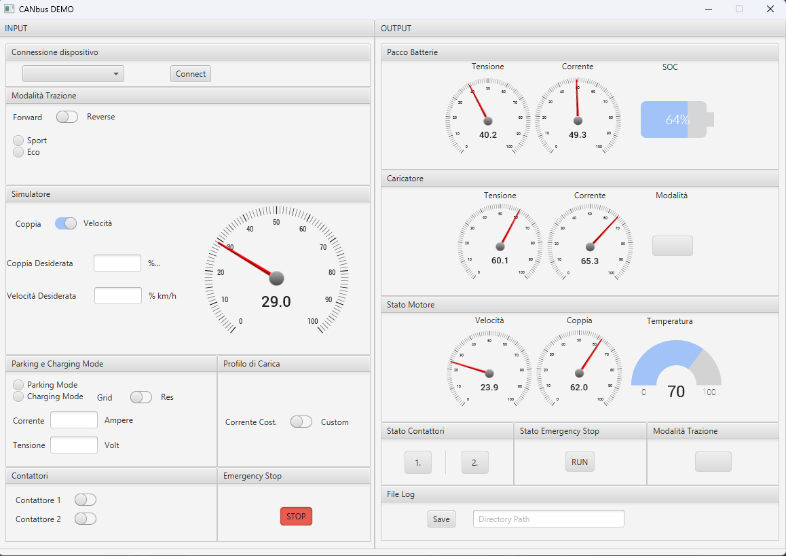

L'applicazione, come evidenziato chiaramente nell'immagine, offre all'utente una distinta separazione tra le componenti dedicate ai valori di input e quelle destinate ai valori di output. Queste ultime sono visibili nella sezione destra dell'applicazione, garantendo un'organizzazione intuitiva e un accesso agevole a tutte le informazioni pertinenti.

### Connessione
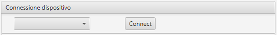
Il primo passo da compiere una volta avviata l'applicazione, consiste nel connettere il CAN bus, selezionandolo dalla lista generata dalla combo box in alto a sinistra e cliccare sul pulsante "Connect".

### INPUT
Dopo aver stabilito la connessione con il CAN bus, si avrà la capacità di personalizzare i valori nella sezione di Input. Di seguito, elencheremo tutte le diverse opzioni disponibili:

#### Modalità Trazione
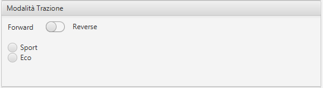

In questa sottosezione sarà possibile scegliere la modalità di trazione, attraverso uno SwitchButton, tra:

- Forward
- Reverse

In particolare, per quanto riguarda la modalità Forward, sarà possibile scegliere tra due modalità diverse attraverso due RadioButton, ovvero:

- Sport
- Eco

#### Simulatore
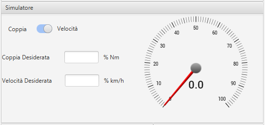

Nella sottosezione Simulatore sarà possibile scegliere la modalità di set point tra:

- Coppia
- Velocità

attraverso uno SwitchButton.

Inoltre, sempre in questa sezione si avrà la possibilità di inserire il set point desiderato, all'interno dei TextField.
Per una più intuitiva comprensione del valore inserito, sarà possibile visualizzarlo in una Gauge adiacente.

#### Parking e Charging Mode
> immagine parking e charging mode

Per ora salto

#### Profilo di Carica

In questa semplice sottosezione sarà possibile scegliere due diversi profili di carica attraverso uno SwitchButton:

- Corrente Costante
- Custom

#### Contattori
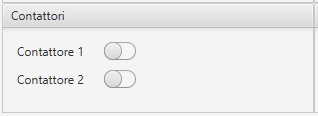

In questa semplice sottosezione sarà possibile scegliere di "caricare" o "scaricare" i due contattori.

#### Emergency Stop
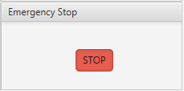

In questa semplice sottosezione sarà possibile premere il pulsante di Emergency Stop, che bloccherà l'applicazione e manderà a zero tutti i valori di input.

### OUTPUT

#### Pacco Batterie
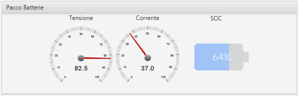

In questa sottosezione sarà possibile visualizzare i valori di Tensione, Corrente e State of Charge attraverso, rispettivamente due Gauge e una Batteria.

#### Caricatore
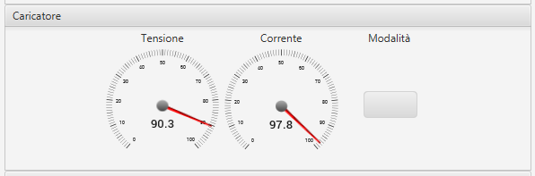

In questa sottosezione sarà possibile visualizzare i valori di Tensione e Corrente del charging tramite una Gauge e la modalità di charging tramite uno StatusButton.

#### Stato Motore
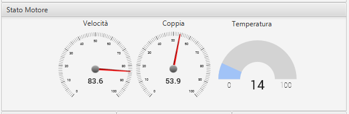

In questa sottosezione sarà possibile visualizzare i valori Velocità, Coppia e Temperatura del motore, attraverso tre diverse Gauge.

#### Stato Contattori
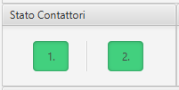

In questa semplice sottosezione sarà possibile visualizzare lo stato dei contattori.

#### Sato Emergency Stop
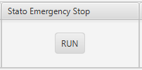

In questa semplice sottosezione sarà possibile visualizzare lo stato dell'Emergency Stop tramite uno StatusButton.

#### Modalità di Trazione
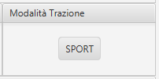

In questa semplice sottosezione sarà possibile visualizzare lo stato della modalità di trazione selezionata tramite uno StatusButton.

#### File Log
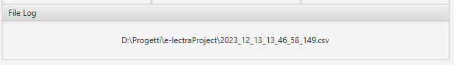

In questa sottosezione sarà possibile inserire il percorso per la creazione di un file di Log di alcuni dei principali elementi più significativi, con un annesso timestamp.
## Problemi Comuni
Il principale messaggio di errore che può presentarsi riguarda la mancata connessione con un valido CAN bus, generando il seguente pop-up:

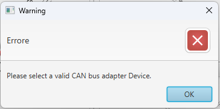

## Supporto e Contatti

Per domande o problemi, contattaci a:
- [Achille Cannavale](mailto:achille.cannavale@studentmail.unicas.it)
- [Giada Pietrocola](mailto:giada.pietrocola@studentmail.unicas.it).
- [Paolo Simeone](mailto:paolo.simeone@studentmail.unicas.it).

