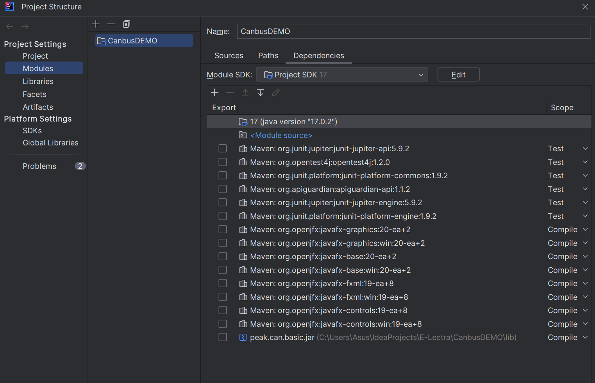
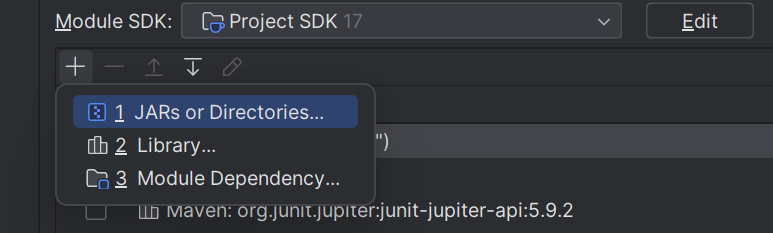
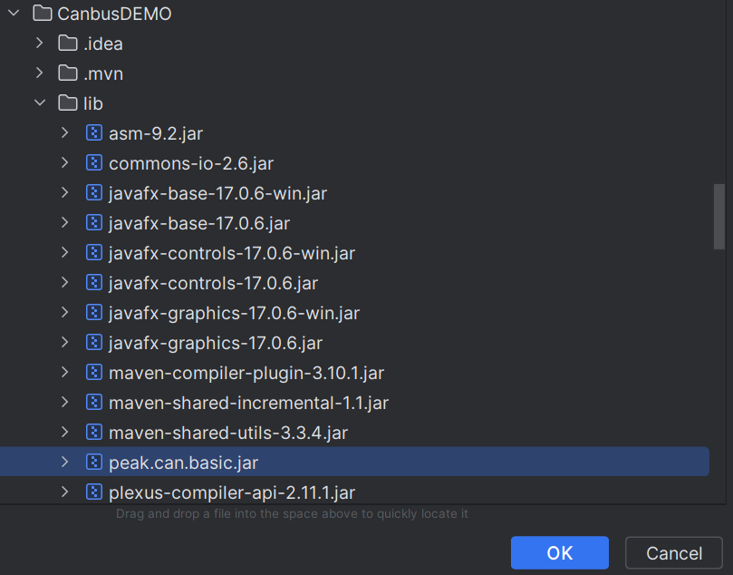
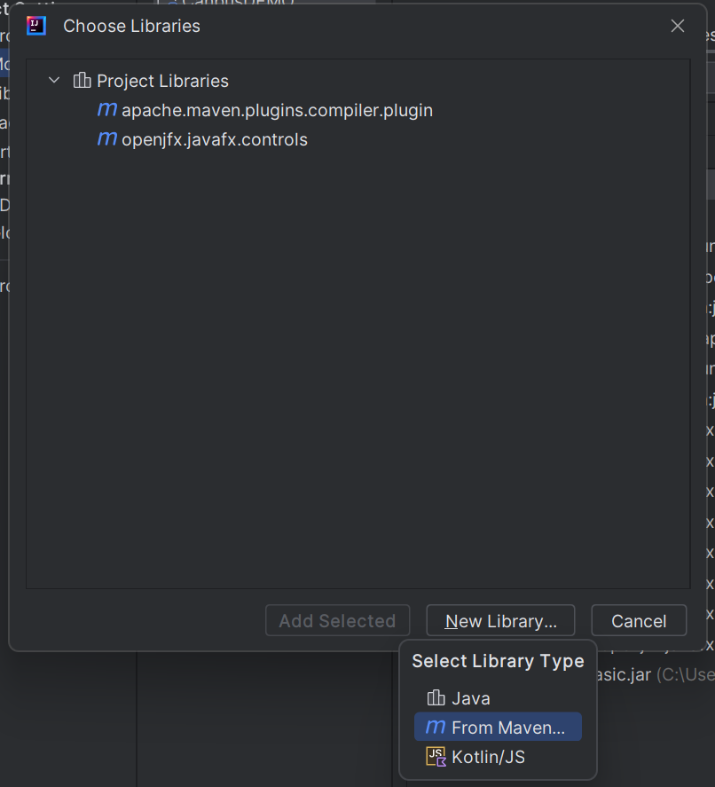
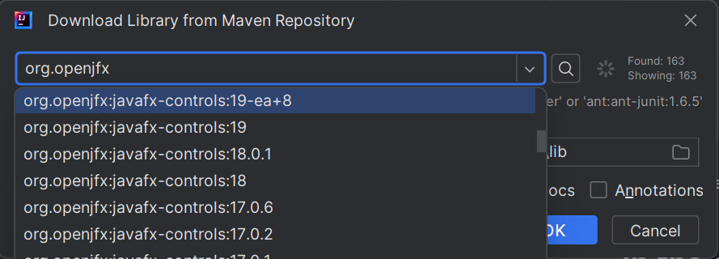

# CanbusDEMO
## IMPORTANTE
Al fine di poter utilizzare correttamente i driver java relatica al PCAN-USB adapter, è necessario installare i driver windows disponibili o a questo [_link_](https://www.peak-system.com/Drivers.523.0.html?&L=1&gclid=EAIaIQobChMI6J7My6moggMVf5eDBx35RwaIEAAYASAAEgK8pfD_BwE) o installando l'applicativo Peak CAN View ([_link_](https://www.peak-system.com/PCAN-View.242.0.html?&L=1)).

## Clone del progetto
Clone the project with the following command:
```
git clone https://github.com/E-Lectra-IT-Challenge-2024/CanbusDEMO.git
```
Then open the project inside IntelliJ, and check if all the library have been correctly imported:


In case something is missing add it by following this procedure.

## In the case you are missing one of the .jar ones
Click on the + button and choose **_1 JARs or Directories..._**: 



Then navigate to CanbusDEMO => lib => _select the missing one_



## In the case the missing library is not present inside **_lib_** folder
Click on the + button and choose **_2 Library..._**, then select **_New Library_** => **_From Maven..._**



And then try to find the missing library from Maven:



### In case of others problem contact me at _luca.gerevini@e-lectra.it_
